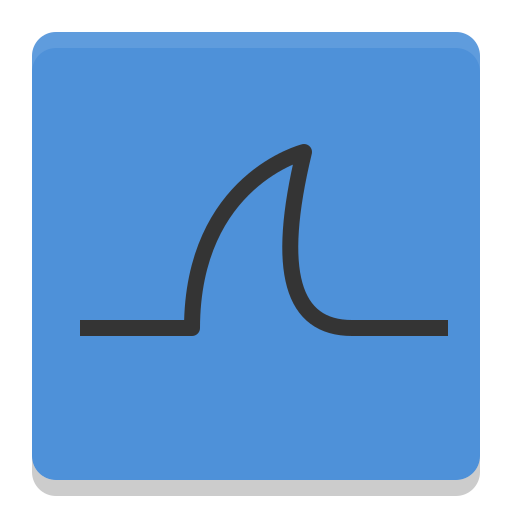

# m22kats
## Hi, there ☻
My name is Marianne. I'm a junior web developer with over  years of working experience.  
I have a well-rounded set of skills in both frontend and backend development.  
My current goal is to ✨<em>MASTER FRONTEND SKILLS</em>✨ and establish it as my own domain of expertise.   

## Tech stack
#### Work Experience

    
	
	
	
	
	
	
    
	
	
	
	
	
    
	
	
	
    
	
	
    
	
    

#### Dabbled and Explored

	
	
	
	
	
	
	
	
	
	
	
	

 

 
👨🏼‍💻 I have some familiarity with microservices architecture, including working with an API gateway.  
🚀 I have some practical experience in configuring microservices with a Java backend.  
👽 I make an effort to standardized data formats in my work.  
🤖 I can set up and use Angular and React as well as Node.  
🤓 I can work with minimal supervision when it comes to frontend development.  

 

  
