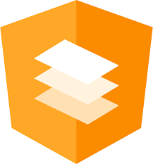

# m22kats
## Hi, there ☻
My name is Marianne. I'm a web developer with over 3years of working experience.  
I have a well-rounded set of skills in both frontend and backend development.  

## Tech stack
#### Work Experience

    
    
    
    
    
    
    
    
    
    
    
    
    
    
    
    
    
    
    
    
    
    
    
    

  
